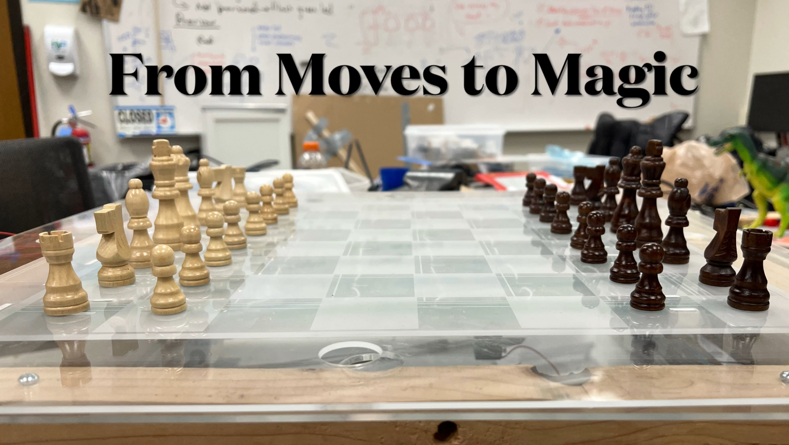
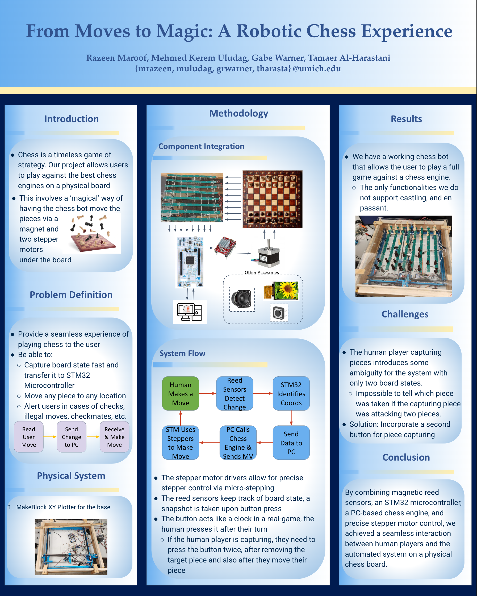

# Physical Chess Bot

  
<strong>Video Demo</strong>

  

This repository showcases the Physical Chess Bot, a project that combines robotics and embedded systems to create an interactive and engaging chess-playing experience.
The bot uses:
- Linear Actuator with Stepper Motors: For precise movement and microstepping control.
- Magnet End-Effector: To manipulate magnetic chess pieces accurately on the board.
- Reed Sensor Array: To enable real-time tracking of piece movements during gameplay.
- LCD Interface and Speaker System: Enhancing user interaction and providing clear feedback.

The project demonstrates expertise in:
- Embedded Systems Design: Precise motor control and real-time processing of sensor data.
- Hardware-Software Co-Design: Seamless integration of mechanical components and software.
- User-Centric Design: Focusing on intuitive gameplay and interaction.

Explore the code and hardware implementation details to see how advanced control systems, sensor integration, and embedded programming were used to bring this chess bot to life!

Here is the poster that we presented at the Fall 2024 EECS 373 Project Symposium:

  

